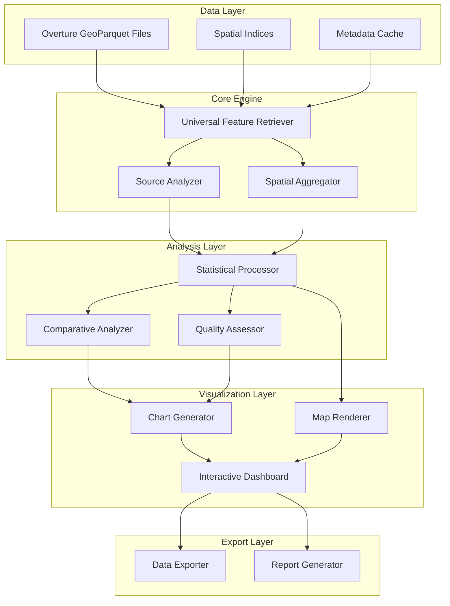

# Design Document

## Overview

The Overture Data Source Analyzer is a comprehensive system that extends the existing BuildingRetriever functionality to support analysis and visualization of data sources across all Overture Maps feature types. The system provides both programmatic APIs and interactive visualization capabilities to understand data source composition, coverage patterns, and quality metrics across different geographic regions and feature types.

The design leverages the existing RAPIDS/CUDA-accelerated geospatial stack and builds upon the proven spatial indexing and querying patterns established in the current BuildingRetriever implementation.

## Architecture

### High-Level Architecture



### Component Interaction Flow

1. **Data Discovery**: System scans Overture data directories to identify available themes and types
2. **Index Building**: Creates spatial indices for each feature type using existing BuildingRetriever patterns
3. **Query Processing**: Handles spatial queries across multiple feature types simultaneously
4. **Source Analysis**: Extracts and categorizes data source information from the `sources` field
5. **Visualization Generation**: Creates interactive charts and maps using the processed data
6. **Export Processing**: Generates reports and exports data in various formats

## Components and Interfaces

### 1. Universal Feature Retriever

**Purpose**: Extends BuildingRetriever pattern to support all Overture feature types

**Key Classes**:
```python
class OvertureFeatureRetriever:
    """Universal retriever for any Overture Maps feature type"""
    
    def __init__(self, base_path: Path, theme: str, feature_type: str)
    def query_bbox(self, minx, miny, maxx, maxy, **kwargs) -> pd.DataFrame
    def get_available_themes(self) -> List[str]
    def get_available_types(self, theme: str) -> List[str]
    def get_schema_info(self) -> Dict[str, Any]

class MultiFeatureRetriever:
    """Manages multiple feature retrievers for comparative analysis"""
    
    def __init__(self, base_path: Path)
    def add_feature_type(self, theme: str, feature_type: str)
    def query_all_types(self, minx, miny, maxx, maxy) -> Dict[str, pd.DataFrame]
```

**Interfaces**:
- Consistent spatial querying API across all feature types
- Schema introspection for dynamic field discovery
- Efficient spatial indexing using existing patterns
- Support for streaming large result sets

### 2. Source Analyzer

**Purpose**: Extracts and analyzes data source information from Overture features

**Key Classes**:
```python
class SourceAnalyzer:
    """Analyzes data source composition and patterns"""
    
    def extract_sources(self, features_df: pd.DataFrame) -> pd.DataFrame
    def categorize_sources(self, sources_df: pd.DataFrame) -> Dict[str, int]
    def calculate_coverage_metrics(self, sources_df: pd.DataFrame) -> Dict[str, float]
    def assess_data_quality(self, sources_df: pd.DataFrame) -> Dict[str, Any]

class ComparativeSourceAnalyzer:
    """Compares source composition across regions or feature types"""
    
    def compare_regions(self, region_analyses: List[Dict]) -> pd.DataFrame
    def compare_feature_types(self, type_analyses: Dict[str, Dict]) -> pd.DataFrame
    def identify_coverage_gaps(self, analyses: List[Dict]) -> List[Dict]
```

**Interfaces**:
- Source extraction from complex nested structures
- Statistical analysis of source distributions
- Quality assessment based on confidence scores and metadata
- Comparative analysis across different dimensions

### 3. Visualization Engine

**Purpose**: Creates interactive charts and maps for data source visualization

**Key Classes**:
```python
class ChartGenerator:
    """Generates interactive charts using Plotly/Bokeh"""
    
    def create_source_distribution_chart(self, source_stats: Dict) -> Figure
    def create_comparative_chart(self, comparison_data: pd.DataFrame) -> Figure
    def create_coverage_timeline(self, temporal_data: pd.DataFrame) -> Figure

class MapRenderer:
    """Creates interactive maps using Leafmap/Folium"""
    
    def create_source_distribution_map(self, geo_data: gpd.GeoDataFrame) -> Map
    def create_coverage_heatmap(self, coverage_data: gpd.GeoDataFrame) -> Map
    def create_comparative_map(self, multi_source_data: Dict[str, gpd.GeoDataFrame]) -> Map

class DashboardBuilder:
    """Combines charts and maps into interactive dashboards"""
    
    def create_analysis_dashboard(self, analysis_results: Dict) -> Dashboard
    def add_interactive_controls(self, dashboard: Dashboard) -> Dashboard
    def export_dashboard(self, dashboard: Dashboard, format: str) -> str
```

**Interfaces**:
- Consistent styling and theming across visualizations
- Interactive controls for filtering and exploration
- Export capabilities for static and interactive formats
- Integration with Jupyter notebook environments

### 4. Spatial Aggregator

**Purpose**: Handles spatial aggregation and sampling for large datasets

**Key Classes**:
```python
class SpatialAggregator:
    """Aggregates spatial data at different scales"""
    
    def aggregate_by_grid(self, data: gpd.GeoDataFrame, grid_size: float) -> gpd.GeoDataFrame
    def aggregate_by_boundaries(self, data: gpd.GeoDataFrame, boundaries: gpd.GeoDataFrame) -> gpd.GeoDataFrame
    def create_density_surface(self, data: gpd.GeoDataFrame) -> gpd.GeoDataFrame

class SpatialSampler:
    """Handles sampling strategies for large datasets"""
    
    def systematic_sample(self, bounds: Tuple, sample_size: int) -> List[Tuple]
    def stratified_sample(self, regions: gpd.GeoDataFrame, samples_per_region: int) -> List[Tuple]
    def adaptive_sample(self, initial_results: Dict, target_precision: float) -> List[Tuple]
```

## Data Models

### Core Data Structures

```python
@dataclass
class FeatureTypeConfig:
    """Configuration for a specific Overture feature type"""
    theme: str
    feature_type: str
    base_path: Path
    geometry_column: str = "geometry"
    source_column: str = "sources"
    
@dataclass
class SourceInfo:
    """Information about a data source"""
    dataset: str
    property: Optional[str]
    record_id: Optional[str]
    confidence: Optional[float]
    update_time: Optional[str]

@dataclass
class AnalysisResult:
    """Results of source analysis for a region"""
    region_id: str
    bounds: Tuple[float, float, float, float]
    feature_type: str
    total_features: int
    source_breakdown: Dict[str, int]
    coverage_metrics: Dict[str, float]
    quality_scores: Dict[str, float]
    
@dataclass
class VisualizationConfig:
    """Configuration for visualization generation"""
    chart_type: str
    color_scheme: str
    interactive: bool = True
    export_format: Optional[str] = None
```

### Database Schema (for caching and intermediate results)

```sql
-- Feature type registry
CREATE TABLE feature_types (
    id INTEGER PRIMARY KEY,
    theme VARCHAR(50),
    type VARCHAR(50),
    base_path TEXT,
    geometry_column VARCHAR(50),
    source_column VARCHAR(50),
    last_indexed TIMESTAMP
);

-- Analysis results cache
CREATE TABLE analysis_results (
    id INTEGER PRIMARY KEY,
    region_id VARCHAR(100),
    feature_type_id INTEGER,
    bounds_minx REAL,
    bounds_miny REAL,
    bounds_maxx REAL,
    bounds_maxy REAL,
    total_features INTEGER,
    analysis_date TIMESTAMP,
    FOREIGN KEY (feature_type_id) REFERENCES feature_types(id)
);

-- Source statistics
CREATE TABLE source_statistics (
    id INTEGER PRIMARY KEY,
    analysis_result_id INTEGER,
    dataset VARCHAR(100),
    feature_count INTEGER,
    percentage REAL,
    avg_confidence REAL,
    FOREIGN KEY (analysis_result_id) REFERENCES analysis_results(id)
);
```

## Error Handling

### Error Categories and Strategies

1. **Data Access Errors**
   - Missing or corrupted GeoParquet files
   - Invalid spatial indices
   - Network connectivity issues for remote data
   - **Strategy**: Graceful degradation with fallback to available data sources

2. **Memory and Performance Errors**
   - Out-of-memory conditions with large datasets
   - GPU memory exhaustion
   - Query timeout scenarios
   - **Strategy**: Automatic chunking, progressive loading, and resource monitoring

3. **Data Quality Errors**
   - Malformed source metadata
   - Invalid geometries
   - Inconsistent schemas across files
   - **Strategy**: Data validation, cleaning pipelines, and quality reporting

4. **Visualization Errors**
   - Rendering failures with large datasets
   - Browser memory limits for interactive visualizations
   - Export format compatibility issues
   - **Strategy**: Progressive rendering, format fallbacks, and user warnings

### Error Handling Implementation

```python
class DataSourceAnalyzerError(Exception):
    """Base exception for analyzer errors"""
    pass

class DataAccessError(DataSourceAnalyzerError):
    """Errors related to data access and loading"""
    pass

class AnalysisError(DataSourceAnalyzerError):
    """Errors during analysis processing"""
    pass

class VisualizationError(DataSourceAnalyzerError):
    """Errors during visualization generation"""
    pass

# Error handling decorators
def handle_data_errors(func):
    """Decorator for handling data access errors"""
    def wrapper(*args, **kwargs):
        try:
            return func(*args, **kwargs)
        except (FileNotFoundError, PermissionError) as e:
            raise DataAccessError(f"Data access failed: {e}")
        except Exception as e:
            logger.error(f"Unexpected error in {func.__name__}: {e}")
            raise
    return wrapper

def handle_memory_errors(func):
    """Decorator for handling memory-related errors"""
    def wrapper(*args, **kwargs):
        try:
            return func(*args, **kwargs)
        except MemoryError:
            logger.warning("Memory limit reached, switching to chunked processing")
            return func(*args, **kwargs, use_chunking=True)
    return wrapper
```

## Testing Strategy

### Unit Testing
- Individual component testing with mock data
- Source extraction and categorization logic
- Spatial query accuracy and performance
- Visualization generation with known datasets

### Integration Testing
- End-to-end analysis workflows
- Multi-feature type comparative analysis
- Export functionality across different formats
- Dashboard generation and interactivity

### Performance Testing
- Large dataset processing benchmarks
- Memory usage profiling
- GPU acceleration effectiveness
- Concurrent analysis capabilities

### Data Quality Testing
- Schema validation across different Overture releases
- Source metadata consistency checks
- Geometric validity verification
- Statistical accuracy validation

## Performance Considerations

### Optimization Strategies

1. **Spatial Indexing**
   - Reuse existing BuildingRetriever spatial indexing patterns
   - Implement R-tree indices for complex geometries
   - Cache spatial indices across analysis sessions

2. **GPU Acceleration**
   - Leverage RAPIDS cuDF for large DataFrame operations
   - Use cuSpatial for geometric computations
   - Implement fallback to CPU processing when GPU unavailable

3. **Memory Management**
   - Implement streaming processing for large datasets
   - Use chunked analysis for memory-constrained environments
   - Provide configurable memory limits and warnings

4. **Caching Strategy**
   - Cache analysis results for repeated queries
   - Implement intelligent cache invalidation
   - Support persistent caching across sessions

### Scalability Design

- Horizontal scaling through parallel processing of independent regions
- Vertical scaling through GPU acceleration and optimized algorithms
- Progressive loading and rendering for interactive visualizations
- Configurable precision vs. performance trade-offs

## Security and Privacy

### Data Protection
- No collection or transmission of sensitive location data
- Local processing of all geospatial information
- Secure handling of user-defined geographic boundaries

### Access Control
- File system permission respect for data access
- Configurable data source restrictions
- Audit logging for data access patterns

This design provides a comprehensive foundation for implementing the Overture Data Source Analyzer while building upon the proven patterns and performance optimizations of the existing system.